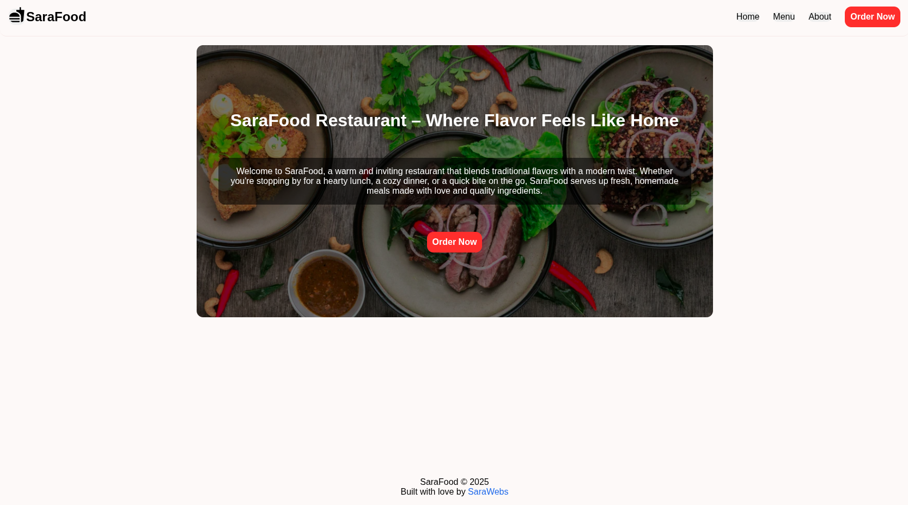
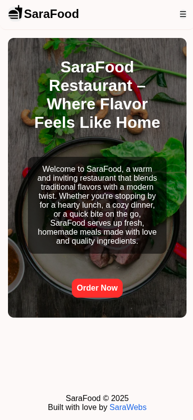

# top-resturant
Library Project, [TOP project](https://www.theodinproject.com/lessons/node-path-javascript-restaurant-page)

I used MVC with pure javascript.

FontAwsome for icons

Mobile first design

[Live DEMO](https://mdahamshi.github.io/top-resturant/)

<!--  -->

